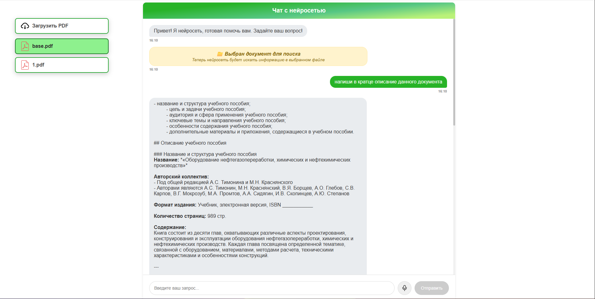

Сайт для запросов к нейросети GigaChat от Sber 

pip install supabase requests

pip install PyPDF2

pip install gigachat

pip install supabase

pip install pdf2docx

pip install flask

pip install flask_cors 

Таблица для БД:

CREATE TABLE pdf_files (
    id BIGSERIAL PRIMARY KEY,
    name TEXT NOT NULL,
    storage_path TEXT NOT NULL,
    file_url TEXT,
    file_size BIGINT,
    uploaded_at TIMESTAMPTZ DEFAULT NOW(),
    gigachat_file_id TEXT,
    txt_path TEXT,
    processed_path TEXT
);

ALTER TABLE pdf_files DISABLE ROW LEVEL SECURITY;

Запуск сайта: AI_GigaChat\Sber\Frontend> npm run dev
запуск сервера: AI_GigaChat\Sber\Backend\server> py server.py 

В файле сервера нужно указать свой токен!

